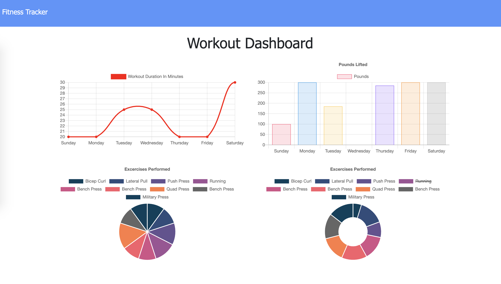

# Exercise Tracker · 

  ## Description

  Exercise Tracker is an app that allows users to view, create, and track daily workouts. Users can log multiple exercises in a workout on a given day. Users can also track the name, type, weight, sets, reps, and duration of exercise. 

  
  
  ## Table of Contents
  
  * [Installation](#installation)
  * [Usage](#usage)
  * [Contributing](#contributing)
  * [License](#license)
  * [Questions](#questions)
  
  
  ## Installation
  
If you'd like to run this application locally, you will need to install the required dependencies using `npm install` and connect to your local MongoDB.
  
  ## Usage 
  
You can view the deployed application [here](https://exercise-tracker-dp.herokuapp.com).
  
  ## Contributing
    
  Open to any and all contributions. Please ensure your pull requests adhere to the following guidelines:
  - Keep descriptions short and simple, but descriptive
  - Check your spelling and grammar

  ## License
  
  Exercise Tracker is [MIT licensed](https://opensource.org/licenses/MIT).

  ## Questions
  
  If you have additional questions, you can reach me at: dpan5425@gmail.com
